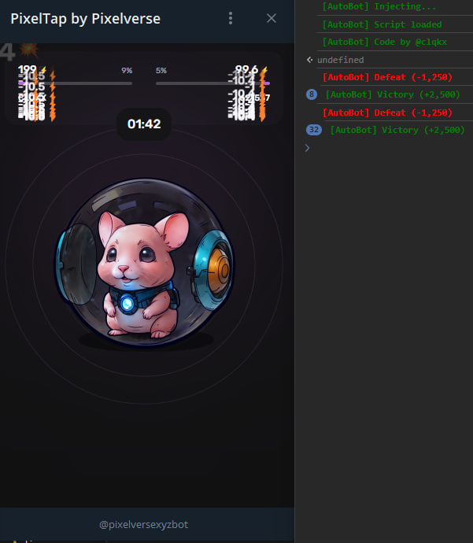

<br>

<div align="center">

[](https://t.me/pixelversexyzbot)

  <h1 align="center">Auto Bot for battles in PixelTap game.</h1>
  
  <p align="center">
    <strong>The bot automatically participates in battles in the PixelTap game.</strong>
  </p>
  

</div>

## Enable Debug Mode for Mini Apps

### Android
- **[Enable USB-Debugging](https://developer.chrome.com/docs/devtools/remote-debugging/)** on your device.
- In Telegram Settings, scroll all the way down, press and hold on the version number two times.
- Choose Enable WebView Debug in the Debug Settings.
- Connect your phone to your computer and open chrome://inspect/#devices in Chrome – you will see your Mini App there when you launch it on your phone.

### Telegram Desktop on Windows and Linux
- Download and launch the **[Beta Version](https://desktop.telegram.org/changelog#beta-version)** of Telegram Desktop on Windows or Linux (not supported on Telegram Desktop for macOS yet).
- Go to Settings > Advanced > Experimental settings > Enable webview inspection.
- Right click in the WebView and choose Inspect.

### Telegram macOS
- Download and launch the **[Beta Version](https://telegram.org/dl/macos/beta)** of Telegram macOS.
- Quickly click 5 times on the Settings icon to open the debug menu and enable “Debug Mini Apps”.

## Launch script

Follow the steps below to launch script:

1. Open the game in Telegram Web App and the web inspector of your browser. You can do this by right-clicking on the page and selecting **"Inspect"** or **"Inspect Element"** (depending on the browser).

2. Switch to the **"Console"** tab. In the console at the bottom of the page, enter the copied script and press the **Enter** key.

```
const consoleStyles = {
    red: 'font-weight: bold; color: red;',
    green: 'font-weight: bold; color: green;',
    prefix: '%c [AutoBot] '
};

const sleep = ms => new Promise(resolve => setTimeout(resolve, ms));
const originalConsoleLog = console.log;

['log', 'error', 'warn', 'info', 'debug'].forEach(method => {
    console[method] = function (...args) {
        if (args[0].includes('[AutoBot]') || args[0].includes('github.com')) {
            originalConsoleLog.apply(console, args);
        }
    };
});

console.clear();
console.log(`${consoleStyles.prefix}Injecting...`, consoleStyles.green);

const clickElement = element => element?.click();

let lastClickedElement = null;
let waitingGame = false;
const stats = {
    victories: 0,
    defeats: 0,
    totalCoins: 0,
    tryConnect: 0
};

const handleBattleMode = () => {
    waitingGame = false
    const superAttackCards = document.querySelectorAll('._card_n90wq_1');
    
    if (superAttackCards.length) {
        clickElement(superAttackCards[Math.floor(Math.random() * superAttackCards.length)]);
    } else {
        const clickableElement = document.querySelector('.clickableArea') || lastClickedElement;
        clickElement(clickableElement);
        lastClickedElement = clickableElement;
    }
};

const resetConnection = async () => {
    const mainButton = document.querySelector('#root > div > div > div:nth-child(1) > div > div > button');
    const claimBtn = document.querySelector('#root > div > div > div:nth-child(1) > div > div.earnContent > button');
    const navLinks = document.querySelectorAll('#root > div > div > nav > a');

    mainButton.click();
    await sleep(1500);
    navLinks[0].click();
    claimBtn.click()
    await sleep(1500);
    navLinks[2].click();
    await sleep(1500);
    mainButton.click();
};

const formatNumberWithCommas = number => number.toString().replace(/\B(?=(\d{3})+(?!\d))/g, ",");

const handlePostBattle = async () => {
    const finishTextElement = document.querySelector('#root > div > div > div:nth-child(1) > div > div > h3');
    const searchTimer = document.querySelector('#root > div > div > div:nth-child(1) > div > div > button > div._timer_cjqyd_18 > div._digits_cjqyd_40');

    if (finishTextElement && !waitingGame) {
        waitingGame = true
        const playBtn = document.querySelector('#root button._button_uyw8r_1._purple_uyw8r_31._textUppercase_uyw8r_28');
        const finishCoinsText = document.querySelector('#root ._reward_bgfdy_17 > span')?.innerText || '';
        const isVictory = !finishCoinsText.includes('-');
        const finishCoins = parseInt(finishCoinsText.replace(/[^\d-]/g, ''), 10);

        if (isVictory) {
            stats.victories++;
        } else {
            stats.defeats++;
        }
        stats.totalCoins += finishCoins;

        console.log(`${consoleStyles.prefix}${isVictory ? 'Victory' : 'Defeat'} (${finishCoinsText})`, isVictory ? consoleStyles.green : consoleStyles.red);
        console.log(`${consoleStyles.prefix}[${stats.victories} W | ${stats.defeats} L | ${stats.totalCoins >= 0 ? '+' : '-'}${formatNumberWithCommas(stats.totalCoins)}]`, consoleStyles.green);

        stats.tryConnect = 0;
        await sleep(1500);
        if (playBtn) clickElement(playBtn);
    } else if (searchTimer && searchTimer.innerText === '10') {
        if (stats.tryConnect > 30) {
            stats.tryConnect = 0;
            await resetConnection();
        }
        stats.tryConnect++;
    }
};

const findAndClick = () => {
    if (document.querySelector('#root ._battle_topbar_1b18t_1')) {
        handleBattleMode();
    } else {
        handlePostBattle();
    }
};

const observer = new MutationObserver(mutations => {
    mutations.forEach(mutation => {
        mutation.addedNodes.forEach(node => {
            if (node.nodeType === 1 && node.classList.contains('clickableArea')) {
                clickElement(node);
                lastClickedElement = node;
            }
        });
    });
});

observer.observe(document.body, { childList: true, subtree: true });

setInterval(findAndClick, 80);

console.log(`${consoleStyles.prefix}Script loaded`, consoleStyles.green);
console.log(`${consoleStyles.prefix}Code by @clqkx`, consoleStyles.green);
```

### That's it! Now you can use this script for automatic battles in the PixelTap game on Telegram.

## Author

Telegram: [@clqkx](https://t.me/clqkx)
Telegram Channel: [@clqkxdev](https://t.me/clqkxdev)
